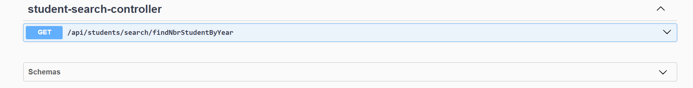
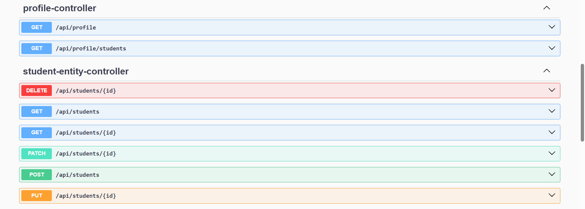
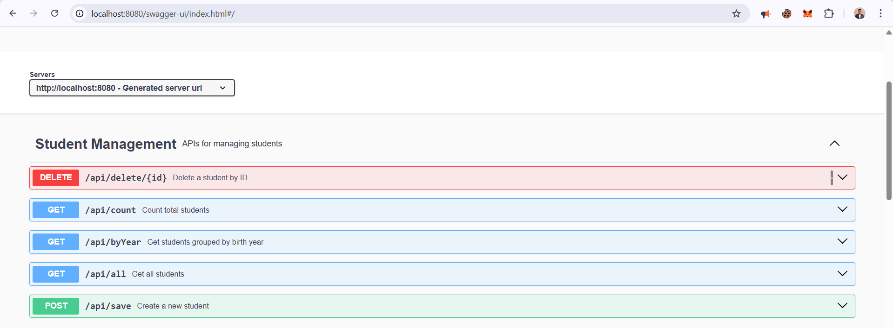

# Student Management System

A Spring Boot application for managing student records with REST APIs.

## API Documentation

The API documentation is available via Swagger UI when the application is running.

### Available API Controllers

1. **Student Search Controller**

   - Search students by various criteria including birth year

2. **Profile Controller**

   - Manage student profiles
   - Access student-related profile information

3. **Student Entity Controller**
   - Core CRUD operations for student records
   - Create, Read, Update, and Delete student data

### Student Management APIs

Available endpoints:

- `GET /api/all` - Get all students
- `GET /api/byYear` - Get students grouped by birth year
- `GET /api/count` - Count total students
- `POST /api/save` - Create a new student
- `DELETE /api/delete/{id}` - Delete a student by ID

### Swagger UI

Access the interactive API documentation at:

- Swagger UI: http://localhost:8080/swagger-ui/index.html
- OpenAPI JSON: http://localhost:8080/api-docs

